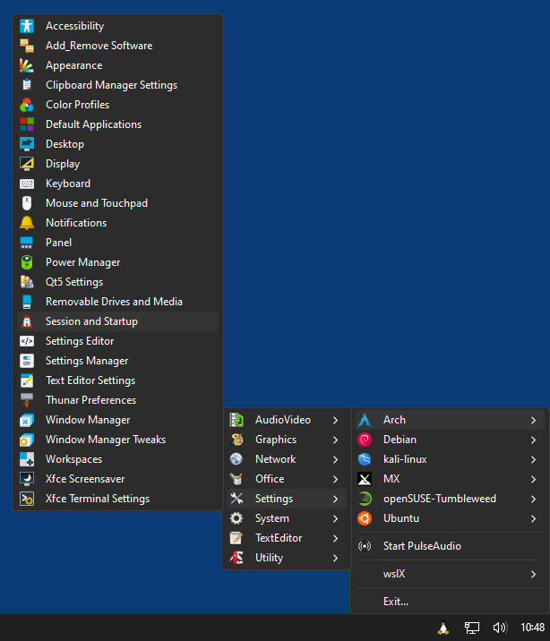
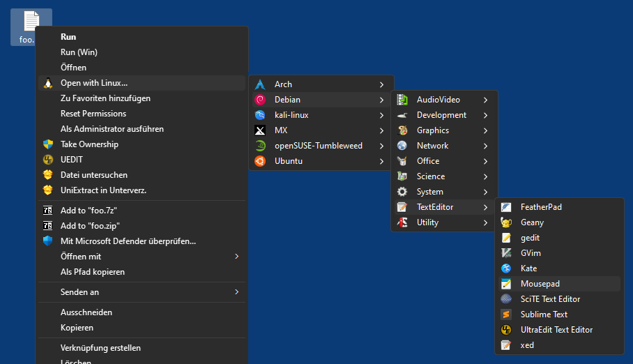
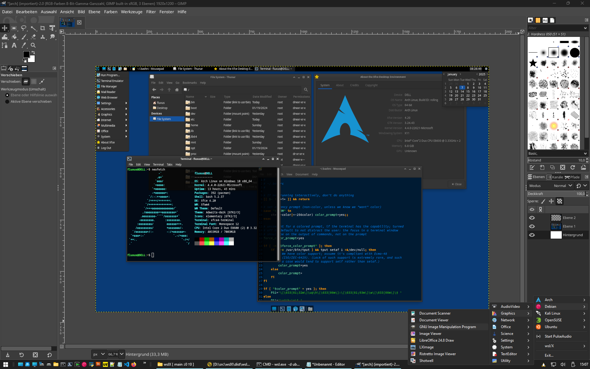
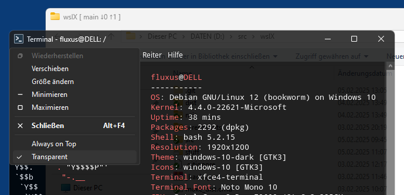

# wslX - an enhanced Windows X-server for WSL

wslX is a patched/extended and repacked version of [Cygwin](https://www.cygwin.com/)'s [Cygwin/X](https://x.cygwin.com/) X.Org server `XWin.exe`, explicitely meant for integrating local WSL Linux GUI applications into the Windows workflow. It supports any Linux distro, but it works best and was mainly tested in combination with a Xfce desktop environment, that's the recommended environment to use in your distro(s).

It's an alternative for [VcXsrv](https://sourceforge.net/projects/vcxsrv/), [Xming](http://www.straightrunning.com/XmingNotes/), [X410](https://x410.dev/) and [WSLg](https://github.com/microsoft/wslg), with a couple of extra features.

wslX is installed and runs solely in user space, it doesn't touch system registry (HKLM) and never requires elevated privileges.

## Features

* Drag-and-drop support - this is wslX's core feature. If a Linux GUI app - e.g. a text editor, image viewer/editor, media player etc. - natively supports dropping files into its window, drag-and-drop actions from Windows explorer (including the desktop) are automatically converted to X drop events, and the dropped file paths are converted to WSL Linux paths (e.g. /mnt/c/...). Windows shortcut files (.LNK) are resolved on the fly. So you can quickly open files in WSL Linux GUI apps by dragging and dropping them from explorer.

* Menu icons in the configurable system tray menu (see screenshot below)

* Automatic creation of "Linux start menus" - including icons - for GUI apps detected in the currently installed WSL distro(s).

* "Open with Linux..." context menu in Explorer that allows to open currently selected files directly in some Linux GUI app. This is not implemented as a shell extension, but just as single item added to HKEY_CURRENT_USER\Software\Classes\*\shell, and therefor lightweight regarding Explorer. The actual  menu is displayed by an independant process.

* Dark window title bars of Linux GUI app windows, if either Windows currently uses a dark theme or dark mode is explitely activated in system.XWinrc (see below). This is missing in other Windows X-servers like VcXsrv or Xming.

* Dark system tray menu (again if either Windows currently uses a dark theme or dark mode is explitely activated in system.XWinrc)

* Listening for TCP/IP connections is by default activated and listing for unix domain sockets by default deactivated, which is the opposite of Cygwin/X's default server configuration (unix domain sockets don't work in between Cygwin's pseudo-Linux layer and WSL Linux).

* PulseAudio for Windows is included and can be started/stopped via the system tray. Start it before using a Linux media player like e.g. Parole or VLC, otherwise audio doesn't work.

## Screenshots

*wslX in system tray of Windows 11*  


*"Open with Linux..." context menu in Windows 11 Explorer*  


*Screenshot of a WSL Arch desktop, edited in a WSL Debian GIMP, all running inside Windows 11 - isn't this beautiful? ;-)*   


## Usage

### a) Installer

The provided installer will automatically try to detect Linux GUI apps in your current WSL Linux Distro(s) after the installation finished, those are then shown in the Linux start menus inside the wslX menu (in the system tray) as well as in the "Open with Linux..." Explorer context menu. The latter will only show those applications that are able to open something (as indicated by having a %f or %u entry in the application's `.desktop` file inside Linux).

You can recreate those menus anytime by selecting `wslX -> (Re)Create application menus` in the wslX menu. 

### b) Portable version (.7z)

If you use the portable version (.7z), you have to select `wslX -> (Re)Create application menus` in the wslX menu after starting wslX for the first time. 

Run `register_open_with_linux.cmd` to add the "Open with Linux..." context menu item to Explorer. Note that the menu won't work anymore if you moved the folder after running the register script, in this case you have to run it again. 

Run `unregister_open_with_linux.cmd` to remove the context menu item from Explorer.

## Notes

* The Linux GUI app detection depends on Python 3 and python3-gi resp. python-gobject being available inside the Linux distro. In Debian-based distros both are usually preinstalled, if app detection fails, run `sudo apt install python3-gi` and then try again. In Arch-based distros use `sudo pacman -S python-gobject` instead.

* "Open with Linux..." is added to the *real* Explorer context menu, not to this weird trailer menu that came with Windows 11. You can deactivate the latter by executing  
    ```
    reg.exe add "HKCU\Software\Classes\CLSID\{86ca1aa0-34aa-4e8b-a509-50c905bae2a2}\InprocServer32" /f /ve
    ```  
    in CMD/PowerShell.

* wslX tries to identify common Linux distros and use an appropriate icon for them. If it fails, e.g. because you use some custom distro name, it uses a generic penguin icon instead. You can provide your own icon by adding a file called `[your-distro-name].ico` to folder `[wslX folder]\data\default-icons\distros\`. Note that .ico files must be uncompressed, "packed" icons (PNG format) are not supported.

* When searching for Linux GUI apps, for each found Linux distro 2 links are added to folder "wslX" in the Windows startmenu:

  * "Shell\\WSL-[distro-name]" for directly opening a bash shell for this distro (with the distro's icon as window icon, resp. as tab icon if you use Windows-Terminal as console host).

  * "Desktop\\WSL-[distro-name]" for starting a fullscreen desktop session for this distro.

  Desktop session links are by default configured for Xfce and will only work if you have a Xfce desktop environment (DE) installed. You can manually edit file `data\DesktopSession.ini` inside the wslX program folder if you want to use a different lightweight DE like e.g. LXDE or LXQt. 
  Other DEs like KDE Plasma, GNOME or Cinnamon are generally much harder to run inside WSL.
  
  wslX, when run normally from the startmenu, is configured for multi-window mode, adds a system tray icon and always uses display port :0. Those desktop session links instead use fullscreen mode without tray icon and always use display port :1.

  Use Alt+TAB to switch between the fullscreen Linux desktop and the Windows desktop. When logging out of the Linux desktop session you should automatically return to the Windows desktop, in case this fails use task manager to kill the "XWin.exe" process.

* Unlike the original Cygwin/X XWin.exe, wslX doesn't try to write to a log file, and therefor can also be run from a read-only directory. All logging is instead written to the Windows debug console and can be analyzed using Sysinternals [DebugView](https://learn.microsoft.com/de-de/sysinternals/downloads/debugview).

* For appearance settings (like a dark theme etc.) to work accurately in multi-window mode (i.e. without a full desktop environment) many apps in Xfce require `xfsettingsd` to run. You might add a line like this to the root menu section in your system.XWinrc file (insert `-d [distro-name]` after wsl.exe if you have multiple distros installed):
    ```
    ...
    SEPARATOR
    "Start xfsettingsd" EXEC "wsl.exe dbus-launch xfsettingsd --replace --no-daemon &"
    SEPARATOR
    ...
    ```
    Or a submenu that allows to both start and stop xfsettingsd by mouse click:

    ```
    MENU xfsettingsd {
        Start EXEC "wsl.exe dbus-launch xfsettingsd --replace --no-daemon &"
        Stop EXEC "wsl.exe pkill xfsettingsd; pkill dbus-daemon; pkill dbus-launch"
    }
    MENU root {
        #<DISTROS>
        ...
        #</DISTROS>
        SEPARATOR
        xfsettingsd MENU xfsettingsd
        SEPARATOR
        ...
    }
    ```

* wslX is meant for WSL, but if have GUI apps like e.g. Leafpad or SciTE installed inside a local Cygwin installation, you can also use it instead of Cygwin's default X-server to allow drag-and-drop from Explorer to such Cygwin app windows. Since wslX translates local Windows paths to /mnt/c/..., but Cygwin instead needs /cygdrive/c/..., just create a symbolic link inside Cygwin like this (in a Cygwin shell):
    ```
    $ cd /
    $ ln -s /cygdrive mnt
    ```
    Now Cygwin can also handle such /mnt/c/..., /mnt/d/... etc. paths and therefor supports drag-and-drop from Explorer.
    
    If wslX is running, you can start a Cygwin GUI app like this (in a Cygwin shell):
    ```
    $ DISPLAY=:0 leafpad
    ```
    Or simply add line `export DISPLAY=:0` to your Cygwin's .bashrc file.

## Configuration (system.XWinrc)

wslX, like other X-servers, is configured by a plain text file called "system.XWinrc", which can be found at:   
`[wslX folder]\data\xwin\etc\X11\system.XWinrc`   

You can open it directly by selecting `wslX -> Edit .XWinrc` from the wslX menu in the system tray.

The general format is documented [here](https://x.cygwin.com/docs/man5/XWinrc.5.html). 

Since wslX itself is installed and executed only in user space, despite its name and original meaning in this case it's not a system-wide configuration file, but always per user (resp. per app folder in case of the portable version).

The `EXEC` instruction, which is the core of all menu commands, does not try to use Cygwin's sh command as in the original Cygwin/X implementation, but instead executes `start` in a (hidden) cmd.exe process.

In addition to the official instructions, wslX supports the following extra instructions:
* `LEFTBUTTON`  
  If this line is found in the config file (default), the system tray icon behaves like the Windows start menu icon and opens the menu by a left mouse click, otherwise the menu is opened by a right mouse click.

* `DARK`  
  If this line is found in the config file (default), the system tray menu as well as Linux GUI app title bars always use dark mode, otherwise dark mode is only used if Windows uses a dark theme.

* `#<AUTOGEN> ... #</AUTOGEN>`  
  Those special comments, in separate lines, mark the section that selecting "(Re)Create application menus" in the system tray menu will completely overwrite when trying to detect WSL Linux GUI apps and create start menus for those. This allows to add arbitrary custom menus and instructions to the config file without the danger to lose them by recreating application menus.

* `#<DISTROS> ... #</DISTROS>`  
  Same as above, but those special comments are instead *inside the root menu section*, and again mark the section that "(Re)Create application menus" will overwrite.

* In addition to `ALWAYSONTOP` wslX also suports the instruction `ALPHA` to be added to the `DEFAULTSYSTEMMENU` section, which allows to make any window transparent. This is just a gimmick and currently hard-coded to an alpha value of 222 (about 87%), but it's activated by default in the config file, and therefor all Linux app windows have both an extra "Always on Top" as well as a "Transparent" item added to their system menu, see this screenshot of a transparent Xfce-Terminal window on top of a Windows explorer window:   



## Compiling XWin.exe

You need a recent version of Cygwin 64-bit. Open a CMD/PowerShell window, cd to your Cygwin's root folder (e.g. C:\cygwin64) and execute the following to install all required prerequisites:
```
$ setup-x86_64.exe -P binutils,bison,cygport,flex,gcc-core,git,meson,ninja,pkg-config,windowsdriproto,xorgproto,libfontenc-devel,libfreetype-devel,libGL-devel,libnettle-devel,libpixman1-devel,libtirpc-devel,libX11-devel,libXRes-devel,libXau-devel,libXaw-devel,libXdmcp-devel,libXext-devel,libXfont2-devel,libXi-devel,libXinerama-devel,libXmu-devel,libXpm-devel,libXrender-devel,libXtst-devel,libxcb-aux-devel,libxcb-composite-devel,libxcb-ewmh-devel,libxcb-icccm-devel,libxcb-image-devel,libxcb-keysyms-devel,libxcb-randr-devel,libxcb-render-devel,libxcb-render-util-devel,libxcb-shape-devel,libxcb-util-devel,libxcb-xfixes-devel,libxcb-xkb-devel,libxcvt-devel,libxkbfile-devel,font-util,ImageMagick,khronos-opengl-registry,python3-lxml,xkbcomp-devel,xtrans,cmake
```
Then switch to an interactive Cygwin64 shell:
```
$ bin\bash --login
```
Run the following to compile and strip XWin.exe:
```
$ git clone https://github.com/59de44955ebd/wslX.git
$ cd wslX/src
$ cygport xorg-server.cygport compile
$ strip xorg-server-21.1.12-1.x86_64/src/xserver-xserver-cygwin-21-1-12-1/x86_64-pc-cygwin/hw/xwin/XWin.exe
```
## To-dos

* Language localisation (currently menu items are english only)
* Port utilities make-menus.exe and wsl-open-with.exe from Python to C
